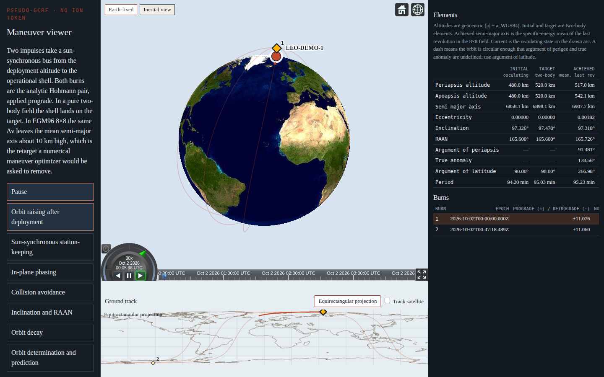
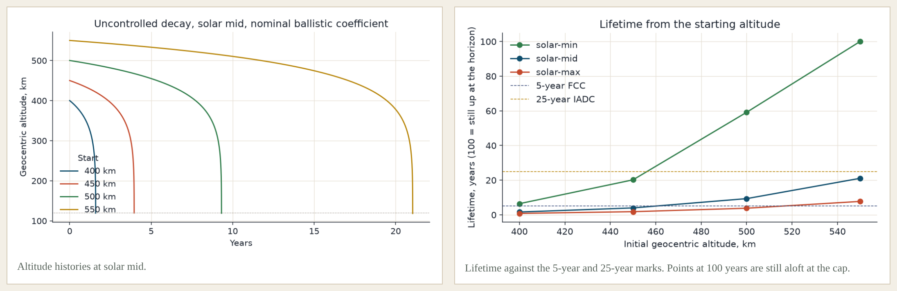
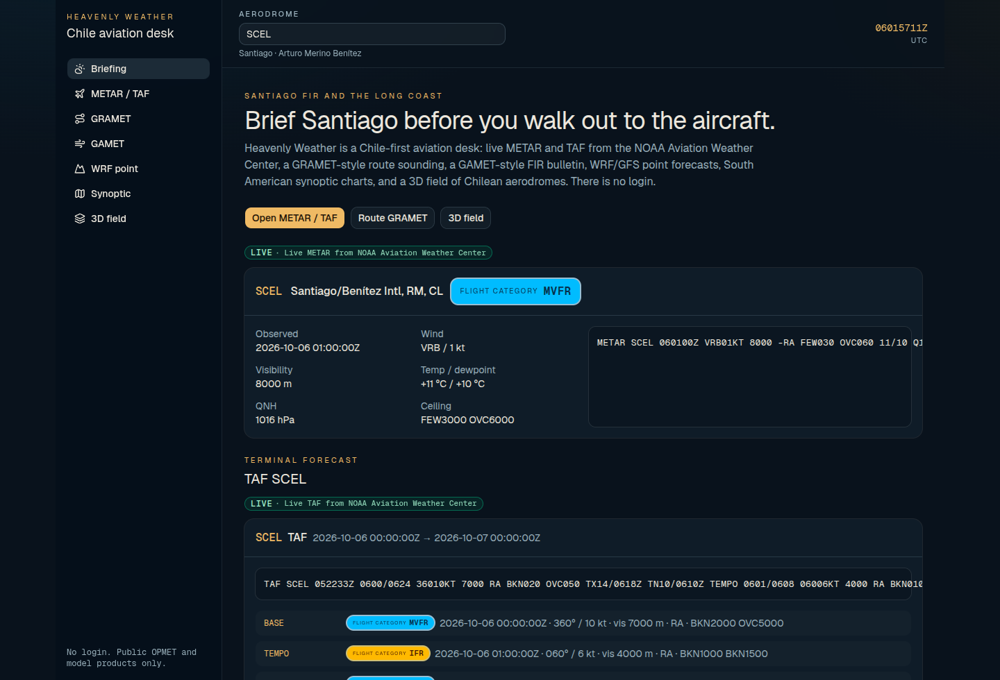

# Pablo Andalaft

Aerospace software and simulation engineering.

I write flight-dynamics tools, simulation pipelines, and the engineering screens around them. The work is remote and fixed-scope, through [Heavenly Tech](https://heavenly.cl), from Santiago, Chile. I am an EU citizen, and I work in Spanish and English.

**[pablo@heavenly.cl](mailto:pablo@heavenly.cl)** · [heavenly.cl](https://heavenly.cl) · [LinkedIn](https://linkedin.com/in/pablo-at)

## Work

### [LEO flight dynamics](https://leo.heavenly.cl)

A demonstrator for a 40 kg-class sun-synchronous bus. Gravity is EGM96 through degree and order 8, so J2 through J8. Maneuver cases hand over orbital elements beside the burn and the Δv: orbit raise, station-keeping, phasing, collision avoidance, and plane change. Decay cases run the same bus down under drag.

Decay is on the same page: altitude through the life of the bus, and how long that life is.

[leo.heavenly.cl](https://leo.heavenly.cl)

### [Heavenly Weather](https://weather.heavenly.cl)

Chile-first aviation desk. Live METAR and TAF, a route GRAMET, GAMET-style bulletins, WRF and GFS point forecasts, South American synoptic charts, and a Cesium globe of Chilean aerodromes. Each product says whether the data is live, derived, or a fallback.

[weather.heavenly.cl](https://weather.heavenly.cl) · [source](https://github.com/heavenly-tech/weather)

## Path

- **Lilium**, Munich. I wrote software on the eVTOL programme: dashboards for aeroelastic results, and a calculation backend on Flask, Slurm, and Azure.
- **University of Bristol.** MEng Aerospace Engineering. Flight dynamics, control, and aerodynamics. Airbus Prize, 2018.
- **42 Wolfsburg.** Software engineering by projects: C and C++, a shell, 2D and 3D graphics, a web server.
- **Heavenly Tech**, founder. Motion simulators, an ArduPilot quadcopter, and the hosted apps. [heavenly.cl](https://heavenly.cl)

Spanish and English day to day. Intermediate German. Student pilot, windsurf instructor, and sailor.

## Other work

| Project | What it is |
| --- | --- |
| [KineVision](https://github.com/celestial-fix/kinevision) | Mobility coach for Bendita Hackathon 2025. The browser reads the exercise, scores the movement, and answers by voice. |
| [Libro de Mora](https://mora.oficinaslascondes.cl) | Late fees on a Chilean lease, including partial payments on different dates. Pesos and UF, in the browser. [Source](https://github.com/heavenly-tech/mora). |
| [Alongside](https://github.com/heavenly-tech/conmigo) | A video call beside the document being presented. Static files. No account. |
| [Envía lite](https://github.com/heavenly-tech/envia_lite) | Personal mail merge: a template, a table, attachments, a full preview, then send. |
| [Valor UF](https://github.com/heavenly-tech/valoruf) | The day's UF from the Comisión para el Mercado Financiero. |

[Aprobado](https://aprobado.heavenly.cl) is a product for the home: connect it once, and it keeps ads, trackers, and unwanted sites off every screen on the network.

## Stack

Python · TypeScript · JavaScript · C · C++ · Bash · MATLAB

NumPy · SciPy · Matplotlib · React · Vite · FastAPI · Flask · Cesium · MediaPipe · Docker · Linux · nginx

## Fixed-scope work

I take remote projects and contracts through Heavenly Tech:

- Flight dynamics and orbital mechanics. Propagation, maneuvers, decay, and the tables an operations desk reads.
- Simulation pipelines and calculation backends.
- Engineering dashboards and tooling for aeroelastic results, CFD output, and the same kind of analysis.
- The screen around those numbers, when someone has to trust what it shows.

General web development is outside that brief.

Write to **[pablo@heavenly.cl](mailto:pablo@heavenly.cl)** with the problem, the deliverable, and the dates.
