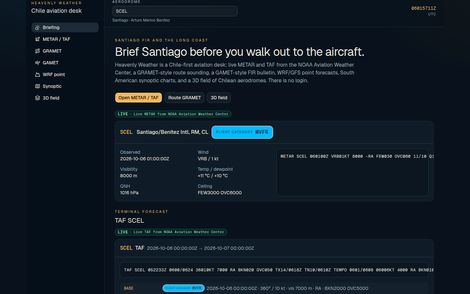
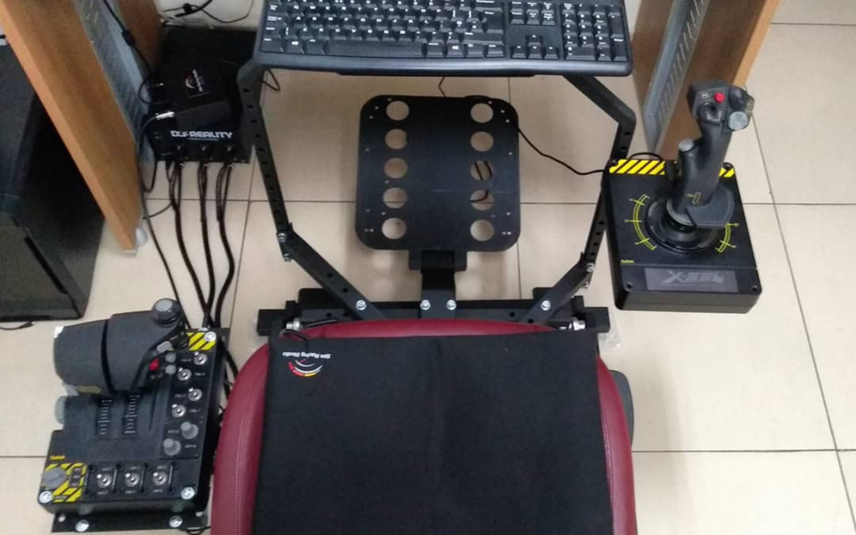
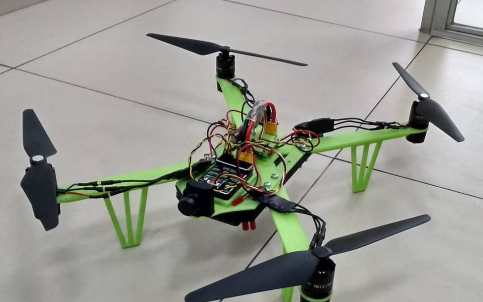
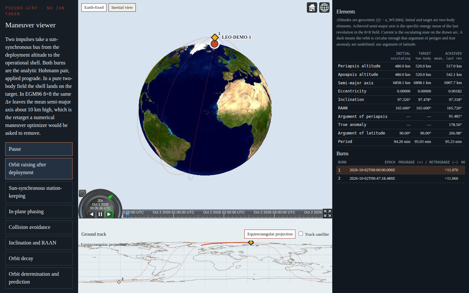

  

# Pablo Andalaft

Aerospace software, simulation, and the tools around them.

Flight dynamics, aviation weather, engineering dashboards, drones and motion rigs, and small apps with a number someone has to trust. I take remote, fixed-scope projects through [Heavenly Tech](https://heavenly.cl), from Santiago, Chile. I am an EU citizen, and I work in Spanish and English.

The full portfolio is at **[heavenly.cl](https://heavenly.cl)**.

**[pablo@heavenly.cl](mailto:pablo@heavenly.cl)** · [heavenly.cl](https://heavenly.cl) · [LinkedIn](https://linkedin.com/in/pablo-at)

## Across the work

<table>
  <tr>
    <td width="50%" align="center" valign="top">
      
       
      <a href="https://weather.heavenly.cl"><b>Heavenly Weather</b></a>
       
      Chile aviation desk. Live METAR and TAF, a route GRAMET, GAMET-style bulletins, WRF and GFS, synoptic charts, and a Cesium globe. <a href="https://github.com/heavenly-tech/weather">Source</a>.
    </td>
    <td width="50%" align="center" valign="top">
      
       
      <a href="https://heavenly.cl"><b>Motion simulator</b></a>
       
      A flight simulator with a motion rig, built at Heavenly Tech.
    </td>
  </tr>
  <tr>
    <td width="50%" align="center" valign="top">
      
       
      <a href="https://heavenly.cl"><b>Quadcopter</b></a>
       
      An ArduPilot quadcopter, frame printed, flown as part of the same shop.
    </td>
    <td width="50%" align="center" valign="top">
      
       
      <a href="https://leo.heavenly.cl"><b>LEO flight dynamics</b></a>
       
      A sun-synchronous demonstrator. EGM96 through degree and order 8 (J2–J8), decay cases, and maneuvers with orbital elements and Δv.
    </td>
  </tr>
</table>

## Useful apps

| Project | What it is |
| --- | --- |
| [KineVision](https://github.com/celestial-fix/kinevision) | Mobility coach for Bendita Hackathon 2025. The browser reads the exercise, scores the movement, and answers by voice. |
| [Libro de Mora](https://mora.oficinaslascondes.cl) | Late fees on a Chilean lease, including partial payments on different dates. Pesos and UF, in the browser. [Source](https://github.com/heavenly-tech/mora). |
| [Alongside](https://github.com/heavenly-tech/conmigo) | A video call beside the document being presented. Static files. No account. |
| [Envía lite](https://github.com/heavenly-tech/envia_lite) | Personal mail merge: a template, a table, attachments, a full preview, then send. |
| [Valor UF](https://github.com/heavenly-tech/valoruf) | The day's UF from the Comisión para el Mercado Financiero. |

[Aprobado](https://aprobado.heavenly.cl) is a product for the home: connect it once, and it keeps ads, trackers, and unwanted sites off every screen on the network.

## Path

- **Lilium**, Munich. I wrote software on the eVTOL programme: dashboards for aeroelastic results, and a calculation backend on Flask, Slurm, and Azure.
- **University of Bristol.** MEng Aerospace Engineering. Flight dynamics, control, and aerodynamics. Airbus Prize, 2018.
- **42 Wolfsburg.** Software engineering by projects: C and C++, a shell, 2D and 3D graphics, a web server.
- **Heavenly Tech**, founder. Motion simulators, an ArduPilot quadcopter, and the hosted apps. [heavenly.cl](https://heavenly.cl)

Spanish and English day to day. Intermediate German. Student pilot, windsurf instructor, and sailor.

## Stack

Python · TypeScript · JavaScript · C · C++ · Bash · MATLAB

NumPy · SciPy · Matplotlib · React · Vite · FastAPI · Flask · Cesium · MediaPipe · Docker · Linux · nginx

## Fixed-scope work

I take remote projects and contracts through Heavenly Tech, in the range above:

- Aerospace software and simulation, including flight dynamics and orbital mechanics.
- Aviation weather and other operational desks.
- Engineering dashboards, calculation backends, and simulation pipelines, including aeroelastic and CFD results.
- Drones, motion rigs, and the smaller apps in the portfolio.

Write to **[pablo@heavenly.cl](mailto:pablo@heavenly.cl)** with the problem, the deliverable, and the dates.
